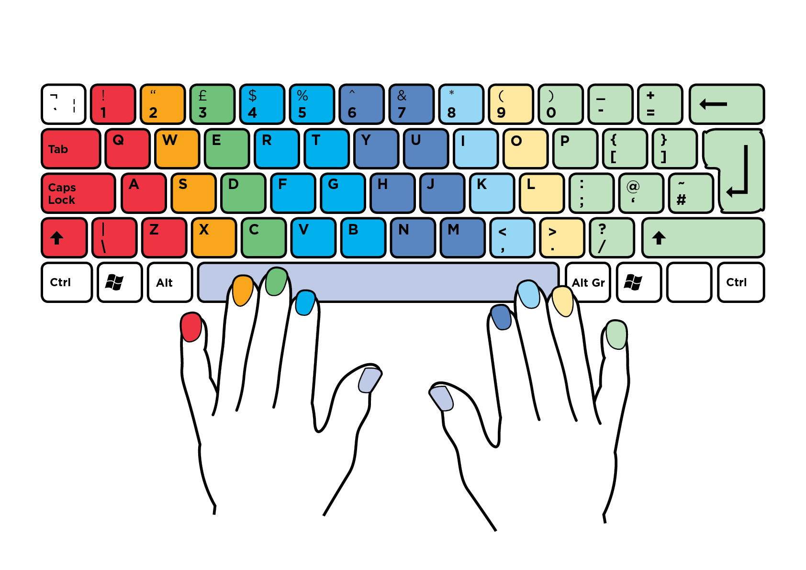

### Hi there, I'm <a href="" target="_blank">Valeria Aguilar</a> 

### Welcome to my page! &nbsp; 

I am currently working on a full-stack developer bootcamp program through UCSD. I love programming, reading, and learning new things.

As a programmer, I love learning new things. That's why I am here today.

  

**More about me:**

- 👩🏽‍💻I’m currently working on something cool;
- 👾 I’m currently learning Javascript and Python on [codewars](https://www.codewars.com/users/vaal96);
- 📫 How to reach me: valeriaaguilar@live.com;
- 📝 [Resume](https://docs.google.com/document/d/1tNQ0jwMONCCEeLH62ZTFOo9a9syCSlfQVn5OoNRa0Gk/edit?usp=sharing).
- 💬 Reach out, I'd be happy to chat;

 

📈 **My GitHub Stats:**

  
  

